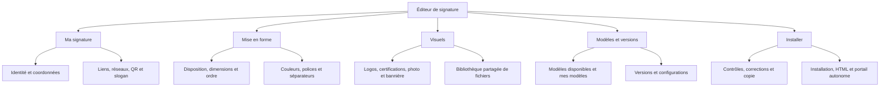

# Signature RAGT — État des lieux de l’application

**Audit du 15 septembre 2026 — interface, navigation, cohérence fonctionnelle et plan de correction**

## 1. Où en sommes-nous ?

**L’application est un éditeur fonctionnel avancé, dont la fiabilité et la simplicité d’utilisation restent à consolider.** Elle permet déjà de composer une signature, de renseigner ses coordonnées, de choisir des visuels et de préparer une diffusion. En revanche, certains réglages n’agissent pas sur le résultat, les sauvegardes n’ont pas toutes la même durée de vie et le portail HTML exporté ne reproduit pas fidèlement le Studio.

Le principal enjeu est de rendre le parcours prévisible : **trouver une information, la modifier, voir le résultat, conserver son travail et installer exactement ce résultat.**

### Synthèse de décision

| Dimension | État constaté | Ce que cela signifie |
|---|---|---|
| Couverture fonctionnelle | Riche | 9 dispositions A–I, 7 modèles prédéfinis, coordonnées, logos, bannières, style, réseaux, QR, copie et exports existent. |
| Organisation | Partiellement consolidée | 5 rubriques principales regroupent 10 panneaux métier, mais les sous-menus sont répétés et plusieurs panneaux ajoutent encore une navigation interne. |
| Lisibilité | Correcte en clair sur grand écran ; dégradée en sombre | Certains champs deviennent presque illisibles en sombre. Beaucoup de textes et de commandes sont très petits. |
| Adaptation aux écrans | Insuffisante | Commandes coupées à 1 280 px, aperçu tronqué à 1 024 px, Studio inutilisable normalement à 390 px. |
| Fiabilité des réglages | Partielle | Ordre des blocs, plusieurs réglages de style et dates de campagne ne produisent pas l’effet annoncé. |
| Sauvegarde et récupération | Partielle | État courant et modèles locaux persistés ; révisions de session non persistées ; réinitialisation sans récupération par Annuler. |
| Fidélité des exports | À corriger en priorité | Deux moteurs HTML différents ; le portail autonome perd des éléments et ramène plusieurs dispositions à la disposition A. |
| Compatibilité messagerie | Non démontrée par cet audit | Les scores intégrés reposent sur des règles locales. Aucune recette dans les clients Outlook/Gmail réels n’a été exécutée ici. |
| Socle technique | Compilation valide | Vérification TypeScript et build réussis. Pas de suite de tests métier ou de parcours trouvée dans le dépôt inspecté. |
| Usage collectif | Fonctionnement principalement local | Sauvegardes dans le navigateur, échanges par fichiers. Aucun stockage partagé, gestion de comptes ou circuit de validation trouvé dans le code inspecté. |

**Bilan : 26 constats regroupés — 3 P0, 17 P1, 6 P2.** Ce nombre décrit les problèmes recensés, pas un pourcentage d’avancement produit.

- **P0** : empêche un usage essentiel dans un contexte observé, altère le livrable ou expose à une perte de travail.
- **P1** : nuit fortement à la fiabilité, à la compréhension ou à l’accès à une fonction.
- **P2** : amélioration de cohérence, d’accompagnement ou de maintenabilité.

### Lecture rapide

- [Cartographie actuelle](#2-cartographie-actuelle)
- [Les 26 problèmes et leur correction](#3-registre-des-problèmes-et-objectifs-de-correction)
- [Organisation cible et regroupements](#4-organisation-cible-recommandée)
- [Plan de réalisation](#5-plan-de-réalisation)
- [Critères de réussite](#6-objectifs-de-réussite-mesurables)
- [Vérifications et limites](#7-vérifications-effectuées-et-limites)

## 2. Cartographie actuelle

### Les trois surfaces à prendre en compte

1. **Studio Communication** : navigation à gauche, aperçu au centre, réglages à droite.
2. **Signature Collaborateur** : formulaire simplifié, aperçu et copie, mais conservation d’une partie des commandes du Studio dans l’en-tête.
3. **Portail autonome `signature.html`** : une autre interface collaborateur, générée dans un fichier HTML, avec son propre formulaire, son stockage et son moteur de rendu.

Le mode collaborateur et le portail autonome répondent au même besoin avec des champs et des comportements différents. Leur cohérence doit devenir un objectif produit explicite.

### Navigation du Studio

| Rubrique actuelle | Panneaux et niveaux internes | Difficulté principale |
|---|---|---|
| Gabarit & Modèles | Mise en page : Modèles, Badges, Dimensions, Position, Ordre. Bibliothèque : Mes Presets, Signatures Com, Historique. | Mélange choix d’un modèle, réglage de structure, médias et sauvegarde. |
| Identité & Contact | Coordonnées : Identité, Téléphonie, Localisation, Libellés. Puis Réseaux sociaux et QR. | L’e-mail est dans Téléphonie ; la recherche ne mène pas au champ exact. |
| Médias & Visuels | Logos : principal, Signatures Com, secondaire, Icônes, Galerie PNG. Puis Bannières & Campagnes, contenant aussi le slogan. | Signatures complètes et images réapparaissent dans plusieurs bibliothèques. |
| Style & Charte | Couleurs, Typographie, Fond & Motifs, Bordures. | Séparateur, slogan, QR et icônes possèdent des réglages concurrents ailleurs. |
| Contrôle & Diffusion | Diagnostic : checklist, clients e-mail, liens, code HTML. Puis Copier & Exporter, configurations et tutoriel. | Contrôles et action finale séparés ; absence de correction directe depuis une alerte. |
| En-tête transversal | Modes, modèle prédéfini, recherche, thème, guide IA, annuler/rétablir, révision, import/export JSON, reset, copie. | Trop d’actions de même niveau et plusieurs doublons. |
| Barre d’aperçu | Clair, sombre, Outlook, mobile, images bloquées, zoom, copie. | La copie est répétée ; les simulations sont plus affirmatives que les preuves disponibles. |

### Ce qui constitue déjà une bonne base

- Aperçu central actualisé lors des modifications.
- Distinction entre coordonnées, visuels et présentation déjà amorcée.
- Miniatures pour choisir les dispositions.
- Visibilité des champs indépendante de leur valeur dans le Studio.
- QR réellement généré à partir des données, avec aperçu du contenu encodé.
- Copie riche, configuration JSON et modèles locaux déjà implémentés.
- Annuler/rétablir, notifications et palette de recherche présents.
- Instructions d’installation accessibles dans les parcours de diffusion.

Ces éléments peuvent être conservés et harmonisés pendant la correction.

## 3. Registre des problèmes et objectifs de correction

**Preuves :** « écran » = constat dans le navigateur local ; « code » = lecture des chemins exécutés ; « sonde » = exécution ciblée des fonctions sur une copie de l’état par défaut. Les sondes n’ont pas modifié la signature de travail.

### A01 — P0 — Interface coupée sur les écrans étroits

**Constat.** À 1 280 × 720, l’en-tête déborde et des actions sortent de la fenêtre. À 1 024 × 768, la signature et sa barre d’outils sont tronquées. À 390 × 844, la navigation de 256 px et le panneau de 420 px absorbent l’espace ; l’aperçu disparaît. Le changement de mode est masqué sous le seuil `lg`. Le formulaire collaborateur mobile ne ménage pas une place exploitable à l’aperçu.

**Correction.** Prévoir trois compositions : grand écran avec aperçu et panneau ; écran intermédiaire avec navigation rétractable ; téléphone avec bascule explicite « Modifier / Aperçu ». Faire tenir les actions essentielles dans l’en-tête et regrouper les actions secondaires.

**Terminé lorsque :** à 390, 768, 1 024, 1 280 et 1 440 px, toutes les fonctions essentielles restent atteignables et aucun contrôle ne déborde de la fenêtre. L’aperçu possède un ajustement à la zone disponible et un accès à l’échelle réelle.

**Preuves :** écran ; [App.tsx](/F:/MonAtelier/Signature/src/App.tsx:19), [Navigation.tsx](/F:/MonAtelier/Signature/src/components/Navigation.tsx:84), [UserModeView.tsx](/F:/MonAtelier/Signature/src/components/UserModeView.tsx:48).

### A02 — P0 — Le portail HTML exporté ne reproduit pas le Studio

**Constat.** La copie du Studio utilise `generateEmailHTML`. Le téléchargement avec un état utilise `generateStandaloneSignatureAppHtml`, dont le rendu traite B et C explicitement et ramène les autres cas à A. Le portail n’intègre pas le slogan, le QR ni la bannière dans son assemblage final. Les réseaux deviennent des initiales ; un logo fourni par URL peut être remplacé par le logo embarqué. Sur le portail par défaut observé, le slogan du Studio a disparu et les icônes ont changé.

**Correction.** Partager un moteur de signature entre aperçu, copie, HTML brut et portail autonome. Présenter séparément « Télécharger la signature HTML » et « Télécharger le portail collaborateur ». Définir précisément le contenu embarqué et le fonctionnement hors connexion.

**Terminé lorsque :** les 9 dispositions, les logos personnalisés, les visibilités, le slogan, les réseaux, le QR et les bannières conservent le même contenu et la même disposition dans chaque sortie. La recette hors connexion ne dépend pas d’une ressource locale manquante.

**Preuves :** écran et code ; [clipboard.ts](/F:/MonAtelier/Signature/src/utils/clipboard.ts:143), [standaloneHtmlGenerator.ts](/F:/MonAtelier/Signature/src/utils/standaloneHtmlGenerator.ts:25), [assemblage autonome](/F:/MonAtelier/Signature/src/utils/standaloneHtmlGenerator.ts:862).

### A03 — P0 — Réinitialisation sans récupération par Annuler

**Constat.** Le bouton de réinitialisation remplace immédiatement l’état et la sauvegarde locale, puis remet l’historique à une seule entrée. Il n’y a pas de confirmation dans l’interface. Cette action peut faire perdre une configuration non enregistrée comme modèle. Elle n’a pas été déclenchée pendant l’audit.

**Correction.** Déplacer l’action dans un menu secondaire, expliquer sa portée et conserver automatiquement une version récupérable avant réinitialisation.

**Terminé lorsque :** un utilisateur peut revenir exactement à sa configuration précédente après un reset, y compris après rechargement, pendant la durée de récupération annoncée.

**Preuve :** code ; [SignatureContext.tsx](/F:/MonAtelier/Signature/src/context/SignatureContext.tsx:452).

### A04 — P1 — Les « révisions sauvegardées » sont temporaires

**Constat.** `savedRevisions` reste en mémoire React ; aucun chargement ni stockage durable des révisions n’est implémenté. Le bouton utilise aussi `prompt()`, qui a échoué dans le navigateur intégré utilisé pour cet audit, avec l’erreur « prompt() is not supported ». Ce second problème dépend de l’environnement ; la non-persistance est confirmée dans le code.

**Correction.** Fusionner révisions et historique dans « Modèles & versions », distinguer les actions récentes des versions conservées, persister ces dernières et remplacer les dialogues natifs par une boîte de dialogue de l’application.

**Terminé lorsque :** une version nommée peut être créée, retrouvée après rechargement puis restaurée ; les erreurs de stockage sont affichées. Le parcours fonctionne dans les navigateurs retenus pour le produit.

**Preuves :** écran, console et code ; [état des révisions](/F:/MonAtelier/Signature/src/context/SignatureContext.tsx:153), [saveRevision](/F:/MonAtelier/Signature/src/context/SignatureContext.tsx:334), [Header.tsx](/F:/MonAtelier/Signature/src/components/Header.tsx:207).

### A05 — P1 — Les formats JSON ne circulent pas entre tous les menus

**Constat.** L’export principal produit une enveloppe `{ app, version, config }`. L’import principal accepte cette enveloppe ou un état brut. L’import de la bibliothèque attend seulement un objet contenant directement `layout` et `personal`. Un export principal est donc refusé par la bibliothèque.

**Correction.** Utiliser le même service d’import/export et le même format versionné pour tous les points d’entrée, en conservant la lecture des anciens fichiers.

**Terminé lorsque :** chaque export proposé peut être réimporté depuis chaque entrée pertinente ; les données et réglages sont identiques après aller-retour.

**Preuves :** code et sonde ; [export principal](/F:/MonAtelier/Signature/src/context/SignatureContext.tsx:470), [import bibliothèque](/F:/MonAtelier/Signature/src/components/panels/TemplatesPanel.tsx:284).

### A06 — P1 — Contrôle trop superficiel des configurations importées

**Constat.** Vérifier uniquement la présence de `layout` et `personal` ne garantit pas que leurs champs, les logos, couleurs ou typographies sont complets. Le chargement initial et l’import principal réalisent une fusion superficielle ; une ancienne configuration partielle peut remplacer une branche complète et provoquer un plantage lors de son utilisation. Le chargement d’un modèle local remplace même l’état entier.

**Correction.** Ajouter validation structurée, migration des anciennes versions, complétion des valeurs par défaut et compte rendu lisible de l’import. Conserver l’état précédent en cas d’échec.

**Terminé lorsque :** fichiers incomplets, corrompus ou d’anciennes versions donnent un résultat défini et un message utile, sans casser l’éditeur ni écraser le travail en cours.

**Preuve :** code ; [chargement initial](/F:/MonAtelier/Signature/src/context/SignatureContext.tsx:114), [import principal](/F:/MonAtelier/Signature/src/context/SignatureContext.tsx:489), [chargement modèle](/F:/MonAtelier/Signature/src/components/panels/TemplatesPanel.tsx:246). Risque de plantage déduit du code ; fichier destructurant non appliqué à la session.

### A07 — P1 — L’ordre des blocs est modifiable mais ignoré

**Constat.** Les flèches modifient `layout.blockOrder`, mais le générateur construit les blocs dans un ordre fixe. La sonde inversant l’ordre a produit exactement le même HTML.

**Correction.** Faire appliquer l’ordre par le moteur pour les dispositions compatibles, ou retirer les déplacements impossibles en expliquant les contraintes du gabarit.

**Terminé lorsque :** chaque déplacement autorisé se voit dans l’aperçu et les exports ; un déplacement interdit n’est pas proposé comme réalisable.

**Preuves :** code et sonde ; [LayoutPanel.tsx](/F:/MonAtelier/Signature/src/components/panels/LayoutPanel.tsx:163), [assemblage HTML](/F:/MonAtelier/Signature/src/utils/htmlGenerator.ts:794).

### A08 — P1 — Plusieurs réglages de style ont des valeurs concurrentes

**Constat.** La couleur « Filet séparateur » écrit dans `design.colors.separator` alors que le rendu lit `layout.separator.color`. La couleur QR de Style écrit `qrFg`, mais le QR lit `qr.fgColor`. La couleur et la typographie du slogan possèdent aussi deux sources ; dans l’état par défaut, modifier celles de Style est sans effet. Enfin, les intitulés « Nom & Prénom » et « Téléphones (Fixe / Mob) » ne modifient chacun qu’une seule clé.

**Correction.** Unifier la valeur de référence de chaque propriété et son édition. Les raccourcis contextuels peuvent subsister s’ils ouvrent le même réglage et affichent la même valeur.

**Terminé lorsque :** couleur du séparateur, du QR, du prénom et du nom, des deux téléphones et du slogan, ainsi que sa police, produisent chacun un effet conforme à leur libellé dans toutes les sorties.

**Preuves :** code et sondes ; [DesignPanel.tsx](/F:/MonAtelier/Signature/src/components/panels/DesignPanel.tsx:123), [liste des couleurs](/F:/MonAtelier/Signature/src/components/panels/DesignPanel.tsx:258), [slogan rendu](/F:/MonAtelier/Signature/src/utils/htmlGenerator.ts:366), [qrGenerator.ts](/F:/MonAtelier/Signature/src/utils/qrGenerator.ts:69).

### A09 — P1 — La date de campagne ne pilote pas la bannière

**Constat.** Le formulaire propose une date de début et le modèle de données contient début et fin. Le générateur vérifie seulement activation, visibilité et image. Une campagne datée de 2099 produit le même HTML qu’une campagne active, à paramètres identiques.

**Correction.** Définir si la date est une note de gestion ou une règle de validité. Afficher clairement « à venir / active / terminée ». Pour une signature déjà copiée dans une messagerie, expliquer qu’un changement de date dans le Studio ne peut pas retirer automatiquement le contenu déjà installé ; prévoir un processus de mise à jour si nécessaire.

**Terminé lorsque :** aucun champ ne laisse croire à une programmation inexistante ; les cas avant début, pendant campagne et après fin ont un comportement documenté et testé.

**Preuves :** code et sonde ; [BannerPanel.tsx](/F:/MonAtelier/Signature/src/components/panels/BannerPanel.tsx:525), [buildBannerHtml](/F:/MonAtelier/Signature/src/utils/htmlGenerator.ts:423).

### A10 — P1 — Les messages de validation sont trop affirmatifs

**Constat.** Le menu affiche « 100% Validé » alors que le diagnostic observé est à 94 %, avec un avertissement sur les images. Le mode collaborateur indique « Prête pour Outlook » de manière fixe. Les étoiles par client sont des règles calculées, parfois des constantes, pas des résultats de tests dans ces clients. L’aperçu Outlook est une composition dans le navigateur.

**Correction.** Afficher le même état partout, nommer le résultat « Vérifications automatiques » et séparer contrôles du code, simulations visuelles et recette réelle. Réserver une mention de validation à un test traçable sur une version identifiée.

**Terminé lorsque :** une erreur ou un avertissement apparaît de façon cohérente dans tous les modes ; chaque affirmation de compatibilité indique son niveau de preuve.

**Preuves :** écran et code ; [badge fixe](/F:/MonAtelier/Signature/src/components/Navigation.tsx:166), [scores clients](/F:/MonAtelier/Signature/src/utils/validator.ts:297), [mode collaborateur](/F:/MonAtelier/Signature/src/components/UserModeView.tsx:212).

### A11 — P1 — Le diagnostic ne conduit pas à la correction

**Constat.** Les alertes sont des textes sans bouton ouvrant le champ concerné. Le diagnostic comporte plusieurs niveaux d’onglets. « Test Liens » ouvre des liens manuellement et ne réalise pas une détection automatique de liens brisés. Lors de l’inspection, 10 liens étaient comptés dans le HTML contre 8 dans la liste ; celle-ci est reconstruite à partir d’une partie de l’état. Le contrôle de contraste ne couvre pas tous les textes affichés.

**Correction.** Réunir résultat, correction et installation sur la même page. Ajouter une action « Corriger » sur chaque anomalie, contrôler les liens de la sortie finale et détailler ce qui a réellement été testé. Distinguer le poids du HTML du poids des images externes.

**Terminé lorsque :** chaque erreur ouvre directement le bon champ ; les liens contrôlés correspondent aux liens exportés ; aucun texte « lien valide » ou « contraste conforme » ne dépasse le périmètre effectivement vérifié.

**Preuves :** écran et code ; [VerifyPanel.tsx](/F:/MonAtelier/Signature/src/components/panels/VerifyPanel.tsx:29), [contraste](/F:/MonAtelier/Signature/src/utils/validator.ts:246).

### A12 — P1 — La copie peut afficher un succès malgré un échec

**Constat.** `CopyPanel` et `UserModeView` activent leur état « copié » après le retour de la fonction, sans vérifier `res.success`. Une notification d’erreur peut alors coexister avec un bouton affichant un succès. Le repli `execCommand('copy')` ne contrôle pas non plus son résultat.

**Correction.** Partager une action de copie avec les états préparation, copie en cours, succès et échec. Confirmer le succès seulement après réussite effective et proposer une solution adaptée à la messagerie cible.

**Terminé lorsque :** permission refusée, conversion d’image échouée ou copie indisponible n’affichent jamais « Signature copiée ». L’utilisateur peut réessayer sans perdre ses réglages.

**Preuve :** code ; [CopyPanel.tsx](/F:/MonAtelier/Signature/src/components/panels/CopyPanel.tsx:23), [UserModeView.tsx](/F:/MonAtelier/Signature/src/components/UserModeView.tsx:35), [clipboard.ts](/F:/MonAtelier/Signature/src/utils/clipboard.ts:69). Refus du presse-papier non provoqué sur la session.

### A13 — P1 — « Modèle Compact » n’a aucune cible

**Constat.** Ce bouton d’export recherche le modèle `compact`, absent des 7 identifiants déclarés. La fonction retourne sans téléchargement ni message.

**Correction.** Générer les commandes depuis le catalogue réel et préciser si l’action exporte le modèle sélectionné ou la configuration courante. Rattacher Compact au modèle voulu après décision produit.

**Terminé lorsque :** chaque commande visible possède une cible valide et fournit le fichier annoncé ou une erreur explicite.

**Preuves :** code et sonde ; [CopyPanel.tsx](/F:/MonAtelier/Signature/src/components/panels/CopyPanel.tsx:43), [bouton Compact](/F:/MonAtelier/Signature/src/components/panels/CopyPanel.tsx:179), [catalogue](/F:/MonAtelier/Signature/src/constants/presets.ts:396).

### A14 — P1 — La navigation multiplie les niveaux et perd la position

**Constat.** Les sous-rubriques apparaissent à gauche et à droite. Plusieurs panneaux ajoutent leurs propres onglets. Changer de grande rubrique revient à son sous-panneau par défaut ; les panneaux démontés perdent aussi leur section locale. La numérotation commence par Gabarit alors que l’application ouvre Identité & Contact.

**Correction.** Une navigation principale, puis des sections explicites dans chaque page. Supprimer la répétition des mêmes onglets. Conserver la dernière section consultée et utiliser des destinations stables pour la recherche et les alertes. Retirer la numérotation si ce n’est pas un assistant à étapes imposées.

**Terminé lorsque :** un besoin courant ne nécessite pas plus de deux choix de navigation ; revenir dans une rubrique restitue la section quittée ; le titre et la sélection reflètent le même endroit.

**Preuves :** écran et code ; [Navigation.tsx](/F:/MonAtelier/Signature/src/components/Navigation.tsx:24), [ContactMasterPanel.tsx](/F:/MonAtelier/Signature/src/components/panels/ContactMasterPanel.tsx:29), [setActiveTab](/F:/MonAtelier/Signature/src/context/SignatureContext.tsx:159).

### A15 — P1 — La recherche trouve un panneau, pas l’information

**Constat.** Rechercher « email » mène à l’onglet Identité, où l’e-mail n’est pas visible : il faut encore choisir Téléphonie. En mode collaborateur, choisir Style dans la palette ferme celle-ci sans ouvrir le Studio. Les mots sont recherchés par sous-chaîne dans dix intitulés, sans index des champs ni normalisation des accents.

**Correction.** Indexer champs, actions et sections avec leurs synonymes : e-mail/courriel/mail, police/typographie, sauvegarde/version, image/photo, etc. Définir une destination complète et faire défiler puis mettre le focus sur la cible. Adapter les résultats au mode courant.

**Terminé lorsque :** chaque terme de la liste de recette mène directement à un contrôle visible et utilisable ; aucun résultat ne ferme la recherche sans effet perceptible.

**Preuves :** deux parcours reproduits à l’écran ; [CommandPalette.tsx](/F:/MonAtelier/Signature/src/components/CommandPalette.tsx:14), [filtrage et ouverture](/F:/MonAtelier/Signature/src/components/CommandPalette.tsx:55), [InfoPanel.tsx](/F:/MonAtelier/Signature/src/components/panels/InfoPanel.tsx:291).

### A16 — P2 — Vocabulaire et quantités peu fiables

**Constat.** « Gabarit », « Modèle », « Preset », « Signatures Com », « Save Revision » et « Snapshot » désignent des objets proches sans explication uniforme. « Exporter » dans l’en-tête signifie JSON. « Téléphonie » contient l’e-mail. Le menu annonce « 80+ » logos/filiales, alors que `PRESET_LOGOS` contient 7 entrées, dont 2 certifications. Les nombreux fonds et motifs ne constituent pas 80 logos de filiales.

**Correction.** Adopter un lexique commun : disposition, modèle, image, version, signature HTML, configuration JSON. Calculer les quantités depuis les données. Remplacer les références conversationnelles comme « à cet endroit » par la destination exacte du visuel.

**Terminé lorsque :** un même objet porte le même nom partout ; tous les comptes reflètent le catalogue affiché ; le résultat d’une action est compréhensible avant le clic.

**Preuves :** écran, code et décompte exécuté ; [logos.ts](/F:/MonAtelier/Signature/src/constants/logos.ts:112), [Navigation.tsx](/F:/MonAtelier/Signature/src/components/Navigation.tsx:53), [BannerPanel.tsx](/F:/MonAtelier/Signature/src/components/panels/BannerPanel.tsx:133).

### A17 — P2 — Bibliothèques dispersées et responsabilités mélangées

**Constat.** Les signatures de communication sont présentes dans Modèles, Logos et Galerie. Les photos se choisissent dans Modèles, Bannières et Galerie. Les badges sont dans Mise en page, les certifications dans Logos et les motifs dans Style. L’utilisateur doit comprendre l’histoire technique de l’application pour choisir le bon endroit.

**Correction.** Une bibliothèque de modèles complets dans « Modèles & versions » et une bibliothèque de fichiers dans « Visuels ». Réutiliser le même sélecteur d’images depuis chaque réglage contextuel, avec une cible explicite : logo, photo, bannière ou fond.

**Terminé lorsque :** chaque ressource possède une fiche unique et une catégorie claire ; modifier ses métadonnées se reflète partout ; appliquer une image indique quel emplacement sera remplacé.

**Preuves :** écran et code ; [TemplatesPanel.tsx](/F:/MonAtelier/Signature/src/components/panels/TemplatesPanel.tsx:44), [LogosPanel.tsx](/F:/MonAtelier/Signature/src/components/panels/LogosPanel.tsx:52), [LayoutPanel.tsx](/F:/MonAtelier/Signature/src/components/panels/LayoutPanel.tsx:37).

### A18 — P1 — Le thème sombre compromet la lecture

**Constat.** Des panneaux restent blancs tandis que leurs champs reçoivent un texte très clair ; les noms et numéros du formulaire collaborateur deviennent presque invisibles. Des titres bleu foncé sont affichés sur fond sombre. Les boutons de prévisualisation inactifs manquent également de contraste. Le rendu clair observé est nettement plus lisible.

**Correction.** Définir des couleurs communes pour surfaces, textes, bordures, états actifs et champs, puis les utiliser dans tous les panneaux. Séparer visuellement le thème de l’éditeur de la simulation de fond de messagerie. Augmenter la taille des libellés essentiels.

**Terminé lorsque :** tous les champs remplis, masqués, désactivés et en erreur restent lisibles dans les deux thèmes ; objectif de contraste texte/fond fixé à au moins 4,5:1 pour le texte courant.

**Preuves :** captures observées à 1 280 et 390 px ; [index.css](/F:/MonAtelier/Signature/src/index.css:5), [InfoPanel.tsx](/F:/MonAtelier/Signature/src/components/panels/InfoPanel.tsx:53), [UserModeView.tsx](/F:/MonAtelier/Signature/src/components/UserModeView.tsx:48).

### A19 — P1 — Les libellés ne sont pas reliés aux champs

**Constat.** Les 8 champs de la section Identité inspectée ont zéro label associé, aucun identifiant et aucun `aria-label`. La présence visuelle d’un texte au-dessus ne donne pas nécessairement un nom accessible au champ. La palette et les onglets personnalisés ne portent pas les relations et états attendus d’une boîte de dialogue ou d’une navigation structurée.

**Correction.** Relier chaque label au champ, nommer les boutons d’icône par leur action et leur cible, exposer les états actifs et les erreurs. Assurer fermeture, confinement puis restitution du focus dans les fenêtres modales. Préserver les raccourcis de saisie dans les champs.

**Terminé lorsque :** le parcours complet fonctionne au clavier ; chaque champ est annoncé avec son nom et son erreur ; les boutons Visibilité précisent le champ concerné ; fermer une fenêtre restitue le focus au déclencheur.

**Preuves :** inspection du DOM et code ; [InfoPanel.tsx](/F:/MonAtelier/Signature/src/components/panels/InfoPanel.tsx:113), [CommandPalette.tsx](/F:/MonAtelier/Signature/src/components/CommandPalette.tsx:80), [raccourcis globaux](/F:/MonAtelier/Signature/src/context/SignatureContext.tsx:366). Recette lecteur d’écran complète non réalisée.

### A20 — P1 — Le mode collaborateur n’explique pas les données absentes

**Constat.** Adresse et site web apparaissent dans la signature mais ne sont pas éditables dans le formulaire simplifié. Le département peut être saisi tout en restant masqué par la configuration du Studio, sans explication. Le portail autonome propose davantage de champs. L’interface annonce une charte validée, mais n’a pas de notion de modèle approuvé ; le mode Studio et l’import restent accessibles.

**Correction.** Partager le formulaire et ses règles entre les deux parcours collaborateurs. Afficher les informations utiles ou les expliquer comme fournies par le modèle. Si une validation Communication est nécessaire, ajouter un vrai statut de modèle et des règles d’édition ; sinon présenter le mode comme simplement simplifié.

**Terminé lorsque :** une information visible dans la signature est modifiable ou accompagnée d’une explication claire ; une modification masquée est signalée ; aucune mention d’approbation ne s’applique à une configuration non approuvée.

**Preuves :** écran et code ; [UserModeView.tsx](/F:/MonAtelier/Signature/src/components/UserModeView.tsx:22), [formulaire](/F:/MonAtelier/Signature/src/components/UserModeView.tsx:74), [portail autonome](/F:/MonAtelier/Signature/src/utils/standaloneHtmlGenerator.ts:19).

### A21 — P1 — Masquer un champ ne le masque pas dans la vCard

**Constat.** Le générateur vCard lit les données personnelles sans consulter les visibilités. La sonde confirme qu’un e-mail masqué dans la signature est encore encodé. Cela peut être un choix valable, mais le périmètre de « Masqué » n’est pas explicité. Les contenus vides peuvent aussi être remplacés par des destinations RAGT par défaut.

**Correction.** Distinguer « Afficher dans la signature » et « Inclure dans le QR ». Donner un résumé lisible de toutes les données encodées et demander un contenu explicite pour les types QR qui l’exigent.

**Terminé lorsque :** l’utilisateur sait exactement ce qu’un scan révèle ; le contenu QR correspond aux choix annoncés ; aucune destination de remplacement n’est utilisée silencieusement.

**Preuves :** code et sonde ; [buildVCardString](/F:/MonAtelier/Signature/src/utils/qrGenerator.ts:7), [getQrRawContent](/F:/MonAtelier/Signature/src/utils/qrGenerator.ts:34).

### A22 — P2 — L’aide principale dépend de l’IA et de sa configuration

**Constat.** Le guide est demandé à Gemini au moment de l’ouverture, avec une recherche de directives « officielles ». Il n’existe pas de guide statique de remplacement dans cette fenêtre ; le serveur renvoie une erreur si la clé n’est pas configurée. La réponse du serveur transmet le texte, sans dispositif explicite de validation éditoriale ou de conservation des références. Les tutoriels d’installation sont ailleurs. Les appels IA n’ont pas été exécutés pendant l’audit.

**Correction.** Centraliser aide d’utilisation, installation et règles de marque validées. Prévoir une aide de base disponible sans IA ; distinguer les suggestions générées des documents de référence et afficher l’indisponibilité du service avant une attente inutile.

**Terminé lorsque :** les opérations courantes peuvent être comprises sans service IA ; chaque règle présentée comme officielle renvoie à une référence validée, avec date ou version.

**Preuve :** code ; [HelpOverlay.tsx](/F:/MonAtelier/Signature/src/components/HelpOverlay.tsx:16), [server.ts](/F:/MonAtelier/Signature/server.ts:16).

### A23 — P2 — Galerie : suppression et classement non stabilisés

**Constat.** Au remontage, la galerie réintroduit les ressources par défaut absentes de la sauvegarde : supprimer une ressource fournie peut donc la faire réapparaître au retour. Une catégorisation répondant en erreur HTTP sans exception laisse l’élément « Analyse en cours… ». Les catégories générées en anglais ne suivent pas les mêmes catégories métier que les filtres de la galerie.

**Correction.** Séparer ressources fournies, ressources ajoutées et masquage personnel. Mémoriser les masquages des ressources fournies. Définir des catégories communes et traiter aussi les réponses HTTP en échec avec un état final explicite.

**Terminé lorsque :** masquer une ressource reste effectif après retour et rechargement ; toute analyse aboutit à une catégorie ou à un message d’échec avec correction manuelle possible.

**Preuve :** code ; [LogosPanel.tsx](/F:/MonAtelier/Signature/src/components/panels/LogosPanel.tsx:58), [catégorisation](/F:/MonAtelier/Signature/src/components/panels/LogosPanel.tsx:78), [catégories serveur](/F:/MonAtelier/Signature/server.ts:90). Aucune ressource utilisateur n’a été supprimée.

### A24 — P1 — L’état réel de l’enregistrement est invisible

**Constat.** L’état courant est enregistré dans le stockage du navigateur, sans indicateur permanent de réussite. Une erreur d’écriture est seulement journalisée. Le stockage contient aussi des images et des modèles potentiellement lourds. Le message de réussite d’un enregistrement de modèle est affiché après l’appel à une fonction qui peut déjà avoir signalé une erreur.

**Correction.** Afficher « Enregistrement… / Enregistré sur cet appareil / Échec », avec dernière date de réussite. Faire remonter l’échec aux appelants. Expliquer la portée locale et proposer une sauvegarde transportable. Adapter le stockage des images si le volume l’exige.

**Terminé lorsque :** un stockage indisponible ou saturé n’affiche jamais une réussite ; une actualisation conserve la dernière version annoncée comme enregistrée ; le périmètre local est compréhensible.

**Preuve :** code ; [écriture état courant](/F:/MonAtelier/Signature/src/context/SignatureContext.tsx:272), [persistPresets](/F:/MonAtelier/Signature/src/components/panels/TemplatesPanel.tsx:220), [handleSaveAsPreset](/F:/MonAtelier/Signature/src/components/panels/TemplatesPanel.tsx:230). Saturation non provoquée dans le navigateur utilisé.

### A25 — P2 — Coûts de calcul et chargement à maîtriser

**Constat.** Le build produit un bundle JavaScript principal de 821,13 kB, soit 249,57 kB compressés, avec avertissement Vite. Toute modification de l’état relance la génération du QR et la conversion de l’ensemble des icônes et images actives. Les composants lourds sont importés directement. Ces éléments constituent un risque de latence, sans mesure de performance utilisateur suffisante pour quantifier un ralentissement.

**Correction.** Mesurer ouverture, saisie et changement de visuel. Mémoriser les conversions selon leurs vraies dépendances, régénérer seulement les ressources concernées et charger les panneaux coûteux à la demande si les mesures le justifient.

**Terminé lorsque :** un budget de chargement est défini et respecté ; la saisie reste fluide avec une galerie représentative ; changer un nom ne reconvertit pas des images inchangées.

**Preuves :** sortie du build et code ; [effet de génération](/F:/MonAtelier/Signature/src/context/SignatureContext.tsx:421), [generateAllIconPngs](/F:/MonAtelier/Signature/src/utils/htmlGenerator.ts:448).

### A26 — P2 — Documentation et preuves de qualité insuffisantes

**Constat.** Le README reste celui du projet AI Studio et décrit peu le produit réel. Il demande `.env.local`, alors que le serveur charge `dotenv.config()` sans chemin explicite. La version métier est 3.0.0, celle du package 0.0.0. `lint` exécute uniquement TypeScript. Aucun script ou fichier de tests métier/de parcours n’a été trouvé dans le dépôt inspecté. Le build passe, mais cela ne garantit pas l’exactitude des signatures.

**Correction.** Documenter démarrage, configuration, modes, stockage, exports et limitations. Unifier la version visible et la version de livraison. Ajouter les tests qui protègent les régressions identifiées, et une matrice de recette des messageries avec résultats datés.

**Terminé lorsque :** une personne peut démarrer le projet et comprendre son périmètre depuis le README ; les parcours essentiels et les défauts corrigés sont couverts ; la compatibilité annoncée correspond à une recette consultable.

**Preuves :** [README.md](/F:/MonAtelier/Signature/README.md:5), [package.json](/F:/MonAtelier/Signature/package.json:2), [version métier](/F:/MonAtelier/Signature/src/constants/presets.ts:4), [configuration serveur](/F:/MonAtelier/Signature/server.ts:7).

## 4. Organisation cible recommandée

### Principe

**Conserver cinq destinations simples, réorganisées autour des besoins.** La diminution des niveaux, des doublons et des réglages concurrents apportera davantage que la seule réduction du nombre de rubriques. Fusionner toutes les options dans un grand menu « Personnaliser » risquerait de rendre les informations à nouveau difficiles à trouver.

### Où trouver chaque information ?

| Besoin de l’utilisateur | Destination cible | Présentation recommandée |
|---|---|---|
| Modifier nom, poste, entreprise | Ma signature → Identité | Champs essentiels en premier. |
| Modifier e-mail et téléphones | Ma signature → Coordonnées | E-mail immédiatement visible avec les téléphones. |
| Modifier adresse ou site web | Ma signature → Coordonnées | Sections Adresse et Site, recherchables directement. |
| Choisir les informations visibles | À côté du champ concerné | Libellé explicite ; valeur conservée et portée indiquée. |
| Modifier réseaux et suivi des liens | Ma signature → Liens et réseaux | Liens d’abord ; suivi des clics dans les options avancées. |
| Choisir ce que révèle le QR | Ma signature → QR code | Contenu encodé, aperçu, inclusion des données. |
| Modifier le slogan | Ma signature → Slogan | Texte et visibilité ; raccourci vers son style. |
| Changer disposition ou dimensions | Mise en forme → Disposition | Miniatures puis réglages utiles à la disposition choisie. |
| Déplacer un bloc | Mise en forme → Ordre | Seulement si le moteur sait appliquer le déplacement. |
| Changer couleurs, police, séparateur | Mise en forme → Style | Une valeur de référence par propriété. |
| Changer logo, badge ou certification | Visuels → Logos et certifications | Sélecteur commun, dimension et cible explicites. |
| Ajouter photo ou bannière | Visuels → Photo et bannière | Image, lien, emplacement, dimensions et état de campagne. |
| Choisir une image de fond | Mise en forme → Fond | Ouvre le sélecteur partagé de Visuels ; aucun second catalogue. |
| Partir d’une carte Communication | Modèles et versions → Modèles disponibles | Choix de la composition complète avec aperçu et effet annoncé. |
| Enregistrer ou restaurer son travail | Modèles et versions → Mes modèles / Versions | Statut local, date, nom, aperçu et restauration. |
| Importer/exporter une configuration | Modèles et versions → Fichiers de configuration | Même format partout ; accessible aussi via une action secondaire. |
| Corriger une anomalie | Installer → Vérifications | Bouton Corriger vers le champ exact. |
| Copier dans Outlook | Installer | Action principale et instructions adaptées au client choisi. |
| Télécharger un fichier | Installer → Autres sorties | Signature HTML et portail collaborateur clairement distingués. |

### Fusions et déplacements précis

| Aujourd’hui | Changement proposé |
|---|---|
| Mise en page + Style & Charte | **Fusionner dans Mise en forme.** La disposition et le style deviennent deux sections cohérentes. |
| Modèles, Presets, Signatures Com, Historique, Save Revision | **Regrouper dans Modèles et versions.** Séparer modèle réutilisable, version enregistrée et actions récentes. |
| Badges dans Gabarits + certifications dans Logos | **Regrouper dans Visuels → Logos et certifications.** |
| Photos/galeries dans trois panneaux | **Partager un seul catalogue et un seul sélecteur contextuel.** |
| Diagnostic & Audit + Copier & Exporter | **Fusionner le parcours dans Installer.** Résultat des contrôles et copie restent visibles ensemble. |
| Slogan dans Bannières | **Déplacer son texte dans Ma signature.** Son style reste dans Mise en forme avec accès direct. |
| Import/export JSON dans l’en-tête et plusieurs panneaux | **Centraliser dans Modèles et versions.** Les éventuels raccourcis appellent le même service. |
| Sous-menus identiques à gauche et à droite | **Supprimer la répétition.** Garder une seule indication de position et des sections internes simples. |
| Copies dans l’en-tête, l’aperçu et la finalisation | **Garder une action principale persistante et celle du parcours Installer**, avec un comportement commun ; enlever la copie redondante de la barre d’aperçu. |

### En-tête proposé

**Nom de la signature — état d’enregistrement — recherche — annuler/rétablir — Installer.**

Le choix du mode, le thème, l’aide et les actions secondaires se rangent dans un menu compact. Le choix du modèle reste accessible via le nom de la signature ou la bibliothèque. La recherche affiche « Rechercher un champ ou une action » et le raccourci correspondant à la plateforme.

### Progressivité et contexte

- Montrer d’abord les réglages usuels ; ouvrir les options avancées à la demande.
- Conserver l’emplacement consulté lors d’un aller-retour entre rubriques.
- Donner un accès direct aux champs depuis recherche et diagnostic.
- Afficher la cible avant de remplacer un logo, une bannière ou un modèle complet.
- Permettre à terme de sélectionner un élément de l’aperçu pour ouvrir ses réglages, avec une alternative clavier équivalente.
- Distinguer « données locales », « modèle approuvé » et « export installé ». Ce sont trois états différents.

## 5. Plan de réalisation

Les lots ci-dessous constituent un **plan proposé**, pas des corrections déjà implémentées. Ils couvrent chacun des 26 constats. L’effort ne doit être chiffré qu’après décision sur la portée des exports, les règles de campagne et l’éventuelle validation des modèles.

### Lot 1 — Fiabiliser le résultat produit

**Constats : A02, A07, A08, A09, A10, A11, A12, A13.**

1. Établir une matrice « champ → valeur de référence → aperçu → copie → HTML → portail ».
2. Partager l’assemblage de signature et clarifier les types de téléchargement.
3. Corriger les réglages sans effet et la commande Compact.
4. Réunir les contrôles réels et leurs liens de correction.
5. Unifier les retours de copie et retirer les validations non démontrées.

**Livrable :** une signature identique d’une sortie à l’autre, avec des contrôles honnêtes.

**Validation de lot :** matrice de fidélité sur A–I, cas avec/sans QR, bannière, slogan et logo personnalisé ; tests de réglages ; copie réussie/refusée ; règle de campagne explicite.

### Lot 2 — Sécuriser la conservation et la récupération

**Constats : A03, A04, A05, A06, A24.**

1. Rendre la réinitialisation récupérable.
2. Définir le format de configuration commun et ses migrations.
3. Persister les versions nommées et clarifier l’historique des actions.
4. Propager tous les échecs d’écriture et afficher le statut d’enregistrement.

**Livrable :** une configuration récupérable et transportable, sans faux succès.

**Validation de lot :** rechargement, restauration, reset, fichiers anciens/invalides, aller-retour JSON, stockage indisponible. Utiliser un environnement de test isolé pour les cas de défaillance.

### Lot 3 — Recomposer les menus et la recherche

**Constats : A14, A15, A16, A17.**

1. Mettre en place les cinq destinations cibles et leurs sections.
2. Fusionner Mise en page/Style et Diagnostic/Installation.
3. Regrouper modèles/versions et les bibliothèques de fichiers.
4. Créer un registre des destinations utilisé par navigation, recherche et diagnostic.
5. Uniformiser les libellés et calculer les quantités du catalogue.

**Livrable :** un emplacement identifiable pour chaque besoin, avec des accès directs.

**Validation de lot :** un utilisateur découvre puis retrouve e-mail, logo, police, bannière, QR, sauvegarde, restauration et installation sans aide extérieure.

### Lot 4 — Rendre l’interface utilisable sur chaque écran

**Constats : A01, A18, A19.**

1. Adapter en-tête, navigation, panneau et aperçu aux cinq largeurs de recette.
2. Prévoir Modifier/Aperçu sur téléphone et un zoom d’ajustement.
3. Unifier les styles clair/sombre des composants de formulaire.
4. Corriger labels, focus, dialogues, navigation clavier et états actifs.

**Livrable :** une interface lisible, accessible et sans commandes coupées.

**Validation de lot :** 390, 768, 1 024, 1 280, 1 440 px ; clair/sombre ; zoom navigateur à 200 % ; parcours clavier ; contrôle des contrastes.

**Ordonnancement :** corriger immédiatement les débordements les plus bloquants ; finaliser les compositions après stabilisation de la navigation du lot 3.

### Lot 5 — Harmoniser le parcours collaborateur et l’accompagnement

**Constats : A20, A21, A22, A23.**

1. Partager champs, règles de visibilité et comportements entre mode collaborateur et portail.
2. Rendre les données encodées par le QR compréhensibles et contrôlables.
3. Stabiliser masquage des ressources et catégories de galerie.
4. Fournir une aide disponible sans IA et des références de marque validées.

**Livrable :** un parcours simple, prévisible et explicable à un collaborateur.

**Validation de lot :** données masquées, changement d’adresse, retour à un modèle, QR scanné sur téléphone, IA indisponible, image non classée, retour dans la galerie.

### Lot 6 — Préparer une livraison vérifiable

**Constats : A25, A26.**

1. Mesurer les performances et optimiser les générations inutiles.
2. Compléter README, versions, procédure de build et limitations connues.
3. Automatiser les tests issus des lots précédents.
4. Exécuter la recette dans les messageries réellement utilisées par l’organisation.

**Livrable :** une version identifiée, documentée et accompagnée de preuves de fonctionnement.

**Validation de lot :** compilation et tests verts, budget de performance mesuré, résultats de recette datés, aucun P0 ouvert et chaque P1 résolu ou explicitement arbitré.

### Ordre conseillé

**Commencer par la fidélité des exports, la récupération des données et les débordements bloquants.** Construire ensuite la nouvelle navigation, terminer l’harmonisation des écrans et du parcours collaborateur, puis valider la livraison. Les tests de régression accompagnent chaque lot ; ils ne sont pas tous reportés au dernier.

### Décisions produit à prendre avant les développements concernés

| Décision | Recommandation de départ | Lot concerné |
|---|---|---|
| Quels fichiers doit-on distribuer ? | Conserver signature HTML et portail, avec un moteur commun et deux libellés explicites. | 1 |
| Quel rôle donner aux dates ? | Statut de campagne et alerte d’expiration ; annoncer les limites d’une signature déjà installée. | 1 |
| Combien de temps conserver les versions ? | Conservation durable sur l’appareil avec gestion explicite de l’espace et sauvegarde exportable. | 2 |
| Faut-il un vrai verrouillage Communication ? | Introduire un statut approuvé seulement s’il existe un besoin de validation métier ; ne pas le simuler par le seul mode simplifié. | 5 |
| Quels clients de messagerie sont supportés ? | Partir du parc réellement utilisé ; enregistrer les versions testées et les limites observées. | 6 |
| Faut-il partager les données entre appareils ? | Considérer cela comme une évolution distincte du rangement des menus, à cadrer si nécessaire. | Évolution ultérieure |

## 6. Objectifs de réussite mesurables

Ces valeurs sont des **cibles de recette proposées**, pas des résultats déjà obtenus.

| Objectif | Cible |
|---|---|
| Trouver une information courante | Au plus 2 choix de navigation avant son contrôle. |
| Utiliser la recherche | Un résultat conduit directement au champ/action, avec focus visible. |
| Mesurer la compréhension | 5 utilisateurs représentatifs réalisent les tâches principales ; viser au moins 90 % de tâches réussies sans aide. |
| Évaluer la facilité de recherche | Viser moins de 15 secondes médianes pour retrouver e-mail, logo, police, bannière, sauvegarde et installation. |
| Garantir l’effet des réglages | Chaque contrôle visible modifie le résultat attendu ou explique sa contrainte. |
| Garantir la fidélité | 9 dispositions vérifiées dans aperçu, copie et sorties HTML ; comparaison des contenus, liens et visibilités. |
| Conserver le travail | Rechargement, restauration et reset récupérable passent sur les navigateurs retenus. |
| Échanger les configurations | Tous les formats produits sont réimportables ; les anciens formats ont une migration définie. |
| Adapter les écrans | Aucun contrôle essentiel inaccessible aux 5 largeurs de recette, dans les deux thèmes. |
| Rendre les retours fiables | Aucun succès de copie ou de sauvegarde après échec ; aucune validation globale avec erreurs cachées. |
| Installer dans les messageries | Recette documentée dans chaque client annoncé comme supporté. |

### Parcours de recette prioritaires

1. Nouveau collaborateur → modèle → coordonnées → copie → installation.
2. Recherche « e-mail » → modification → résultat visible → enregistrement confirmé.
3. Changer logo → ajuster taille → vérifier aperçu → exporter fidèlement.
4. Changer police, séparateur, couleur du nom et slogan → vérifier toutes les sorties.
5. Activer QR → choisir les informations → scanner → vérifier le contenu exact.
6. Créer campagne → préciser validité → vérifier statut et consignes de mise à jour.
7. Enregistrer version → recharger → modifier → restaurer.
8. Exporter configuration → réimporter depuis chaque entrée → comparer.
9. Déclencher une erreur → accéder au champ depuis le diagnostic → corriger.
10. Refaire les opérations essentielles sur téléphone, en sombre et au clavier.

## 7. Vérifications effectuées et limites

### Périmètre inspecté

- Application locale : [http://localhost:9395/](http://localhost:9395/).
- Portail généré : [http://localhost:9395/signature.html](http://localhost:9395/signature.html).
- Dépôt local : `F:\MonAtelier\Signature` ; remote vérifié : [Signatures sur GitHub](https://github.com/amadogregory22-crypto/Signatures).
- Commit local inspecté : `c39f9af` — `feat: signature.html autonome et interactif conforme a la charte RAGT et signature (21).html`.
- Version métier déclarée : 3.0.0. Version du package : 3.0.0.
- Rubriques du Studio, bibliothèque de modèles, médias, réseaux, QR, style, diagnostic, export, recherche, mode collaborateur et portail autonome examinés.
- Vérifications visuelles à 1 280 × 720, 1 024 × 768, 390 × 844 et 1 440 × 900 ; comparaison clair/sombre. Les autres tailles du plan restent à tester.

### Résultats des vérifications techniques

| Vérification | Résultat |
|---|---|
| `npm run lint` | Réussi ; il s’agit de `tsc --noEmit`. |
| `npm run build` | Réussi ; avertissement sur le poids du bundle principal. |
| Inverser `blockOrder` | HTML identique : réglage ignoré. |
| Changer la couleur du séparateur dans Style | HTML identique avec l’état par défaut. |
| Changer couleur/police du slogan dans Style | HTML identique avec l’état par défaut. |
| Changer `design.colors.qrFg` | SVG du QR identique. |
| Modifier uniquement début/fin d’une bannière activée | HTML identique, y compris avec dates futures. |
| Masquer l’e-mail puis générer la vCard | E-mail encore encodé. |
| Vérifier l’enveloppe de l’export principal contre le contrat d’import bibliothèque | Enveloppe refusée par ce contrat. |
| Vérifier la cible du bouton Compact | Identifiant absent du catalogue. |
| Décompter `PRESET_LOGOS` et `SIGNATURE_PRESETS` | 7 entrées dans chaque catalogue. |
| Diagnostic de l’état par défaut | 94 %, 0 erreur, 1 avertissement ; menu fixe à 100 %. |
| Recherche e-mail dans le Studio | Ouvre Identité, pas le champ e-mail. |
| Recherche Style en mode collaborateur | Ferme la palette sans changer la vue visible. |
| Inspecter les 8 champs de la section Identité | Aucun label associé ni nom ARIA explicite. |
| Cliquer Save Revision dans le navigateur intégré | Échec `prompt() is not supported` ; la création n’a pas abouti. |

### Ce que cet audit ne prétend pas établir

- La version distante actuellement déployée n’a pas été vérifiée ; le rapport porte sur le code local et l’application locale observés.
- Aucun envoi d’e-mail ni test de collage dans Outlook, Gmail ou sur appareil mobile réel n’a été réalisé.
- Le rendu dans un cadre nommé Outlook n’est pas une preuve du rendu dans le moteur Outlook Windows.
- Les services IA, les uploads personnels, les opérations destructrices et la saturation du stockage n’ont pas été testés en situation réelle.
- Les interactions de chaque option avec chacun des 9 gabarits restent à couvrir par la matrice de recette ; les réglages sans effet listés ont été vérifiés sur l’état par défaut.
- Aucune étude utilisateur ni certification d’accessibilité ou de sécurité complète n’a été menée.
- La provenance et l’approbation officielle des éléments de marque restent à confirmer par leur propriétaire métier.

**Conclusion : la prochaine étape utile est une consolidation orientée parcours et fiabilité.** L’application possède déjà une grande partie des fonctions attendues. Leur regroupement doit s’accompagner d’une source unique pour les réglages, d’un rendu commun, de sauvegardes fiables et de critères de validation vérifiables.

## 8. Correctifs engagés le 16 septembre 2026

Les correctifs ci-dessous sont déjà intégrés dans l’espace de travail ; ils ne remplacent pas les lots restants du plan.

| Sujet | État | Résultat observé |
|---|---|---|
| Exports et imports JSON | Corrigé | Une même enveloppe est produite par les exports et acceptée à l’import. Les configurations partielles sont complétées par les valeurs par défaut. |
| Révisions | Corrigé | Les révisions sont conservées dans le stockage local, limitées à 30, récupérées au rechargement et regroupées avec les modèles ; l’en-tête ne sert plus qu’à créer une version. |
| Réinitialisation | Corrigé | Une confirmation explicite précède l’action et une révision « Avant réinitialisation » est créée. |
| Dialogue de sauvegarde | Corrigé | Le `prompt()` non pris en charge est remplacé par un dialogue accessible dans l’application. |
| Réglages Style | Corrigé en partie | Les couleurs du séparateur, du QR et du slogan ainsi que la typographie du slogan sont désormais transmises au rendu final. |
| Indicateur Outlook | Corrigé | Le menu affiche le score réel comme contrôle automatique et rappelle qu’une recette Outlook reste à consigner. |
| Export Mobile | Corrigé | Le bouton cible désormais le preset existant `mobile-friendly`. |
| Écran étroit | Corrigé en partie | Studio : sélecteur de rubrique et bascule Modifier/Aperçu sous 1 024 px ; le changement Studio/Collaborateur reste disponible sous forme d’icône. |
| Ordre des blocs | Corrigé par retrait | Le contrôle sans effet a été retiré jusqu’à ce qu’un ordre soit supporté par les neuf gabarits. |
| Dates de campagne | Corrigé | Les statuts à venir, active et terminée sont visibles ; seules les campagnes actives sont ajoutées aux nouvelles signatures. |
| Portail autonome | Corrigé | Il embarque le HTML exact du Studio au téléchargement, conserve les réglages lors des changements de coordonnées et régénère son QR localement sans réseau. |
| Retour de copie | Corrigé | Les vues Studio et collaborateur n’affichent plus « copié » après un échec du presse-papier ; le repli `execCommand` est contrôlé. |
| Messages de validation | Corrigé en partie | Le Studio et le mode collaborateur affichent le score calculé, sans revendiquer une validation Outlook. La recette dans les clients réels reste à réaliser. |
| Diagnostic et liens | Corrigé en partie | Les anomalies éditables ouvrent leur rubrique de correction et les liens affichés sont ceux du HTML final. Les contrôles réseau restent volontairement manuels. |
| Champs d’identité | Corrigé | Les huit champs relevés dans l’audit et les huit champs du mode collaborateur disposent maintenant d’un nom accessible explicite. |
| Focus clavier | Corrigé en partie | Un contour jaune à contraste élevé s’affiche sur chaque commande et champ recevant le focus au clavier. |
| Recherche guidée | Corrigé en partie | La palette ouvre et place le focus sur les réglages e-mail, logo, police, bannière et QR Code. |
| Exports HTML | Corrigé | La signature HTML et le portail collaborateur sont deux téléchargements explicites ; le portail signale les images qu’il ne peut pas embarquer. |
| Régression de rendu | Corrigé | `npm test` vérifie les neuf gabarits avec QR, slogan, bannière et images autonomes, la fidélité Studio-vers-portail, la normalisation, les styles, les campagnes et les révisions. |
| Artefact portail | Corrigé | `npm test` contrôle aussi le fichier `public/signature.html` généré : moteur QR local présent et absence de source d’image externe littérale. |

### Vérification après correctifs

- `npm run lint` : réussi.
- `npm run build` : réussi. Le bundle JavaScript principal est découpé à 480,43 kB après minification.
- L’interface locale affiche désormais « 94 % automatique » pour l’état audité ; ce score n’est pas une recette dans Outlook.

### Priorités restantes

1. Effectuer la recette hors connexion des neuf gabarits, puis l’exécuter et la consigner dans Outlook Windows classique, New Outlook et Outlook Web via [RECETTE_OUTLOOK.md](RECETTE_OUTLOOK.md).
2. Vérifier manuellement les largeurs 390, 768, 1 024, 1 280 et 1 440 px dans les thèmes clair et sombre, au moyen de [RECETTE_RESPONSIVE.md](RECETTE_RESPONSIVE.md), puis consigner les anomalies éventuelles.
3. Ajouter des tests navigateur lorsque l’environnement de test sera disponible : téléchargement effectif, refus du presse-papier, erreurs de stockage et parcours responsive.
